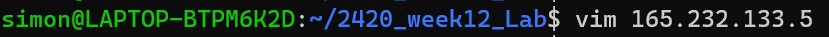

# ACIT 2420 Week 12 Lab

## Repository

### Team Member

+ **Simon Freeman**
  + *A01074210*
+ **Nai Yen Lin**
  + *A01320713*


## Directory Overview


## Step 1

Install **NGINX** with clear instruction
  ```bash
  sudo apt update && sudo apt install nginx 
  ```
The results shall be similar to image below


## Step 2

Create a simple **HTML** file called ***index.html***

Here is sample code shall look like.  
  ```html
    <!DOCTYPE html>
    <html lang="en">
    <html>
        <head>
            <meta charset="UTF-8" />
                <title>Example Site for 2420</title>
        </head>
        <body>
            <h1>Success!</h1>
            <h2 style="color: red;">All your internets are belong to us!</h2>
        </body>
    </html>
  ```

Screenshots of command are provided below.
  ```bash
  vim index.html
  ```


## Step 3

Write a **NGINX server block**

Here is sample code to create the file.  
  ```bash
  vim [ip_address_of_your_host]
  ```

Screenshots of codes in *sever block* are provided below.



## Step 4

Upload the files to **your server** and move them to **appropriate directories**

Use stfp to move files.  
  ```bash
  stfp -i ~/.ssh/[ssh_key_file] [your_destination_host]@[your_destination_ip_address]
  ```
Screenshot of a successful transfer.


Make **directory** for your ***index.html*** 
  ```bash
  sudo mkdir -p /var/www/[your_server_ip_address]/html
  ```

Screenshot is avaliable.


Move your ***index.html*** to appropriate directory
  ```bash
  sudo mv index.html /var/www/[your_server_ip_address]/html
  ```

Move your ***server file*** to appropriate directory
  ```bash
  sudo mv [your_server_file_name] /etc/nginx/sites-avaliable/
  ```

Screenshot is avaliable.


Check your **nginx syntax** to with command
  ```bash
  sudo nginx -t
  ```

Screenshot is avaliable.


Check **permissions** on related files
  ```bash
  sudo chmod +x /etc/nginx/sites-avaliable/[your_server_ip]
  ```

Screenshot is avaliable.


Create **Symbolic link** for related files
  ```bash
  sudo ln -s /etc/nginx/sites-avaliable/[your_server_ip] /etc/nginx/sites-enabled/
  ```

Screenshots are avaliable.


## Step 5

Restart **nginx service**

Codes are provided.
  ```bash
  sudo systemctl daemon-reload
  sudo systemctl restart nginx.service
  sudo systemctl enable nginx.service
  systemctl status nginx.service
  ```

Screenshot is avaliable.


## Step 6

Check if your **webiste** is avaliable by checking ***ip address***

Screenshot is avaliable.


## Step 7

Setup **firewall** using **UFW**

Enable **UFW** with command.
  ```bash
  sudo ufw enable
  ```

Screenshot is avaliable.


Allowing HTTP and OpenSSH.
  ```bash
  sudo ufw allow "Nginx HTTP"
  sudo ufw allow "OpenSSH"
  ```

Screenshots are avaliable.


Optional command for deleting existing rules.
  ```bash
  sudo ufw delete [row index of unwanted rule]
  ```

Screenshot is avaliable.


Check **UFW** status.
  ```bash
  sudo ufw status
  ```

Screenshot is avaliable.


## Step 8

Check if your **webiste** is accessible by ***ip address*** and ***SSH***

Access by ***ip address***


Access by ***SSH***
  ```bash
  ssh -i ~/.ssh/[ssh_key_file] [your_ssh_host]@[your_ssh_ip_address]
  ```

Screenshot is avaliable.


