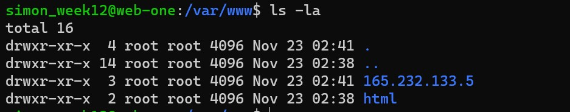

# ACIT 2420 Week 12 Lab

## Repository

### Team Member

+ **Simon Freeman**
  + *A01074210*
+ **Nai Yen Lin**
  + *A01320713*

## Serving an HTML Document and Creating a Firewall

## Directory Overview


## Step 1

Install **NGINX** with the following command:
  ```bash
  sudo apt update && sudo apt install nginx 
  ```
You should see a message similar to image below once installed:


## Step 2

Create a simple **HTML** file called ***index.html***

Here is sample code shall look like.  
  ```html
    <!DOCTYPE html>
    <html lang="en">
    <html>
        <head>
            <meta charset="UTF-8" />
                <title>Example Site for 2420</title>
        </head>
        <body>
            <h1>Success!</h1>
            <h2 style="color: red;">All your internets are belong to us!</h2>
        </body>
    </html>
  ```

Screenshots of command are provided below.
  ```bash
  vim index.html
  ```


## Step 3

Write a **NGINX server block**

Here is sample code to create the file:
  ```bash
  vim [ip_address_of_your_host]
  ```

Here is sample code for server block:
  ```bash
    server {
        listen 80;
        listen [::]:80;

        root /var/www/[ip_address_of_your_host]/html;
        index index.html;

        server_name [ip_address_of_your_host];

        location / {
                try_files $uri $uri/ =404;
        }
    }
  ```

Screenshots of codes in *sever block* are provided below.


## Step 4

Upload the files to **your server** and move them to **appropriate directories**

Use stfp to move files. To access your sftp, enter the following command:

  ```bash
  stfp -i ~/.ssh/[ssh_key_file] [your_destination_host]@[your_destination_ip_address]
  ```
To move your file to your server, enter the following command:
```bash
put [name of your file]
```
Screenshot of a successful transfer.


Make **directory** for your ***index.html*** inside your server:
  ```bash
  sudo mkdir -p /var/www/[your_server_ip_address]/html
  ```

Screenshot is avaliable.


Move your ***index.html*** to appropriate directory in your server.
  ```bash
  sudo mv index.html /var/www/[your_server_ip_address]/html
  ```

Move your ***server file*** to appropriate directory in your server.
  ```bash
  sudo mv [your_server_file_name] /etc/nginx/sites-avaliable/
  ```

Screenshot is avaliable.


Check your **nginx syntax** with the following command to make sure there are no errors in your configuration:
  ```bash
  sudo nginx -t
  ```

If successful, it should look like the screenshot below.


Add execute **permissions** on related files (server block file)
  ```bash
  sudo chmod +x /etc/nginx/sites-avaliable/[your_server_ip]
  ```

Screenshot is avaliable.



Create a**Symbolic link** for related files (server block file)
  ```bash
  sudo ln -s /etc/nginx/sites-avaliable/[your_server_ip] /etc/nginx/sites-enabled/
  ```

Screenshots are avaliable.


## Step 5

Restart **nginx service** before enabling it

To restart and enable your nginx service, use the code provided below:
  ```bash
  sudo systemctl daemon-reload
  sudo systemctl restart nginx.service
  sudo systemctl enable nginx.service
  systemctl status nginx.service
  ```

Screenshot is avaliable.


## Step 6

Check if your **webiste** is active by checking the ***ip address*** you assigned to it in your browser of choice:

Your website should appear in your browser like in the screenshot provided below:


## Step 7

Setup **firewall** using **UFW**

Enable **UFW** with this command:
  ```bash
  sudo ufw enable
  ```

Screenshot is avalaible below. When prompted to proceed with the operation, type and enter y to proceed.


Allow HTTP and OpenSSH connections:
  ```bash
  sudo ufw allow "Nginx HTTP"
  sudo ufw allow "OpenSSH"
  ```

If successful, it should look like the screenshots below:


If you accidentally add an unintended rule, you can delete it by specifying which row it appears in with the following command:

 ```bash
  sudo ufw enable
  ```
Once you have found which row it appears in, use the following command to remove the fule:

  ```bash
  sudo ufw delete [row index of unwanted rule]
  ```

Example of deleting a rule:    


Check **UFW** status to verify you have the correct rules:
  ```bash
  sudo ufw status
  ```

Your UFW status should look similar to this:


## Step 8

Check if your **website** is accessible by ***ip address*** and ***SSH***

To verify it is available through ***ip address***, visit the website by typing the ip address into your browser of choice:


To verify it is available through ***SSH***, attempt to login to your ssh server:
  ```bash
  ssh -i ~/.ssh/[ssh_key_file] [your_ssh_host]@[your_ssh_ip_address]
  ```


If you have completed all these steps, everything should be set up correctly.